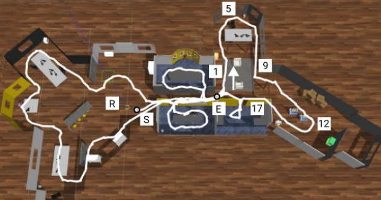
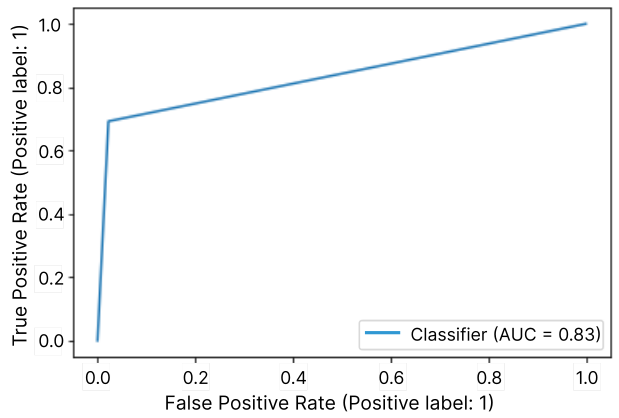

<h1 align="center"> 
	Loop Closure Detection System
</h1>

Content
=================
<!--ts-->
   * [Description](#Description)
   * [Files](#Files)
   * [Videos](#Videos)
   * [Results](#Results)
   * [Scholarships Received](#Scholarships-Received)
<!--te-->

---
Description 
=================
Master's degree in Computer Science at the Federal University of ABC;

Title of Work: Loop Closure Detection in Visual SLAM Based on Convolutional Neural Network;

Student: Fabiana Naomi Iegawa;

Advisor: Wagner Tanaka Botelho;

---
Files 
=================
## CNN
CNN_vgg16.ipynb -> Code implemented for CNN training;

## Gazebo_ROS
/ros_control/move.py -> Code implemented to control robot's movements;

/ros_control/model_state.py -> Code implemented to capture and save images during navigation;

/dataset -> Images captured during navigation;

## System
LoopClosureGazeboOffice_256.ipynb -> System implemented;

Grafico3D.ipynb -> Generate positions' graph;

/tensors_gazebo -> Tensors Database;

/artifacts/jackal_office_gazebo.mp4 -> Video of the navigation on Gazebo;

/artifacts/office_gazebo_model_state.txt -> Robot's positions during navigation;

/artifacts/loop.txt -> Loop closure detected according to the image;

---
Videos
=================

---
Results
=================
Navigation path in Gazebo office scenario.

  

ROC Curve of loop closure detection in Gazebo office scenario.

  

---
Scholarships Received
=================
This work was supported by a Technical Training Fellowship (TT-3/Process Number: 2019/12080-5) funded by the São Paulo Research Foundation (FAPESP)/PIPE Grant Program from July/2019 to December/2020 offered by the Startup NTU Software Technology (Process Number: 2018/04306-0).
