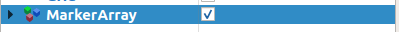

<h1 align="center"> 
	Sistema de SLAM Semântico
</h1>

Sumário
=================
<!--ts-->
   * [Descrição](#Descrição)
   * [Arquivos](#Arquivos)
   * [Comandos](#Comandos)
   * [Vídeos](#Vídeos)
<!--te-->

---
Descrição
=================
Projeto de Graduação em Computação - Universidade Federal do ABC;

Título do Trabalho: Estudo e Implementação de SLAM Semântico para Reconhecimento de Equipamentos de Proteção Individual em Ambiente Simulado;

Estudante: Marcelo Tranche de Souza Junior;

Orientador: Wagner Tanaka Botelho;

Arquivos 
=================
## YOLO
`/script/yolov5/` -> Códigos utilizados (e adaptados) do [repositório do YOLO](https://github.com/ultralytics/yolov5);

`/script/yolov5/runs/train/model/weights/best.pt` -> Pesos do modelo utilizados no trabalho;

## Scripts
`/script/save_image.py` -> Salva as imagens capturadas pela câmera do TurtleBot (Requer Python2, preferencialmente Python 2.7);

`/script/semantic_info.py` -> Identifica os objetos e itens com o YOLO (Requer Python3, preferencialmente python 3.6, além das bibliotecas em `requirements.txt`);

## Dados do Mapa Semântico
`/script/labs.csv` -> Contém informações do mapa semântico, e também os itens proibidos e obrigatórios de cada laboratório[^1];

`/rtabmap.db` -> Arquivo com informações que o RTAB-Map utiliza para criar o mapa semântico[^2] ([Download aqui](https://drive.google.com/file/d/1FqmFN3MPoF-1U2lYamiu10YHtx2_1Sbv/view?usp=sharing));

[^1]: Se quiser criar um novo mapa semântico, remova as informações de coordenadas do `labs.csv` (t_x, t_y, p_x, p_y);
[^2]: Por padrão, `rtabmap.db` deve estar em `/home/user/.ros/`. Se quiser criar um novo mapa semântico, o arquivo não deve estar na pasta.

## Dataset
Dataset utilizado para treinar o YOLO: [https://universe.roboflow.com/pgcmarcelo-tranche-junior/pgc-marcelo-tranche-junior](https://universe.roboflow.com/pgcmarcelo-tranche-junior/pgc-marcelo-tranche-junior)

---
Comandos
=================

    source devel/setup.bash #Source arquivos do catkins
    roslaunch turtlebot_gazebo blocoA_andar3.launch #Inicia ambiente simulado
    roslaunch turtlebot_teleop keyboard_teleop.launch #Inicia controle do TurtleBot pelo teclado
    roslaunch rtabmap_ros demo_turtlebot_mapping.launch simulation:=true #Inicia a biblioteca RTAB-Map
    roslaunch rtabmap_ros demo_turtlebot_rviz.launch #Inicia visualização do mapa semântico no RVIZ (Ative o 'MarkerArray' para visualizar os marcadores dos laboratórios)
    cd script/
    python save_image.py #Começa a salvar as imagens capturadas pelo robô
    python3 semantic_info.py #Começa a identificar os objetos e itens
---

  

Vídeos
=================
Vídeo do robô criando o mapa semântico -> [https://youtu.be/ehB-ZsAkj9M](https://youtu.be/ehB-ZsAkj9M)

Video do robô identificando itens -> [https://youtu.be/jXHsONd9CPM](https://youtu.be/jXHsONd9CPM)

---
Mapa Semântico
=================
Mapa semântico completo do ambiente simulado.

  

