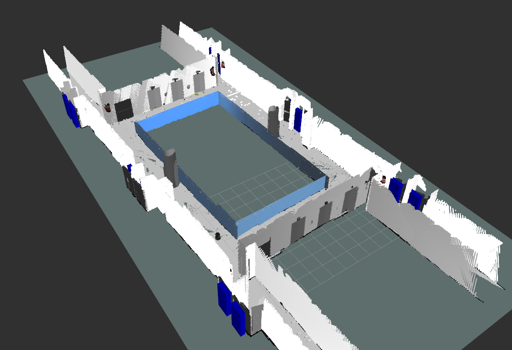

<h1 align="center"> 
	Semantic SLAM System
</h1>

Content
=================
<!--ts-->
   * [Description](#Description)
   * [Files](#Files)
   * [Commands](#Commands)
   * [Videos](#Videos)
   * [Gazebo Scenario](#Gazebo-Scenario)
<!--te-->

---
Description 
=================
Graduation Project in Computing at the Federal University of ABC;

Title of Work: Study and Implementation of Semantic SLAM for Recognition of Personal Protective Equipment in a Simulated Environment;

Student: Marcelo Tranche de Souza Junior;

Advisor: Wagner Tanaka Botelho;

Files 
=================
## YOLO
`/script/yolov5/` -> Codes used (and adapted) from the [YOLO repository](https://github.com/ultralytics/yolov5);

`/script/yolov5/runs/train/model/weights/best.pt` -> Model weights used in the work;

## Scripts
`/script/save_image.py` -> Saves the images captured by TurtleBot (Python2 required, preferably python 2.7);

`/script/semantic_info.py` -> Identify objects and items with YOLO (Python3 required, preferably python 3.6);

## Semantic Map Data
`/script/labs.csv` -> Contains information related to the semantic map, in addition to prohibited and mandatory items for each laboratory;

`/rtabmap.db` -> File with the information that RTAB-Map uses to create the semantic map* ([Download Here](https://drive.google.com/file/d/1FqmFN3MPoF-1U2lYamiu10YHtx2_1Sbv/view?usp=sharing));

*by default it should be in `/home/use/.ros/`. If you want to create the map from scratch, the file must be deleted.

## Dataset
Dataset used to train YOLO: [https://universe.roboflow.com/pgcmarcelo-tranche-junior/pgc-marcelo-tranche-junior](https://universe.roboflow.com/pgcmarcelo-tranche-junior/pgc-marcelo-tranche-junior)

---
Commands 
=================

    source devel/setup.bash #Source the catkins files
    roslaunch turtlebot_gazebo blocoA_andar3.launch #Start simulated environment
    roslaunch turtlebot_teleop keyboard_teleop.launch #Launch TurtleBot keyboard control
    roslaunch rtabmap_ros demo_turtlebot_mapping.launch simulation:=true #Starts the RTAB-Map library
    roslaunch rtabmap_ros demo_turtlebot_rviz.launch #Starts the visualization of the Semantic Map in RVIZ*
    cd script/
    python save_image.py #Starts saving captured images
    python3 semantic_info.py #Starts identifying objects and items
---

Video
=================
Link to Drive video of the robot creating the Semantic Map -> [https://youtu.be/ehB-ZsAkj9M](https://youtu.be/ehB-ZsAkj9M)

Link to Drive video of the robot identifying items -> [https://youtu.be/jXHsONd9CPM](https://youtu.be/jXHsONd9CPM)

---
Semantic Map
=================
Complete semantic map of the simulated environment.

  

